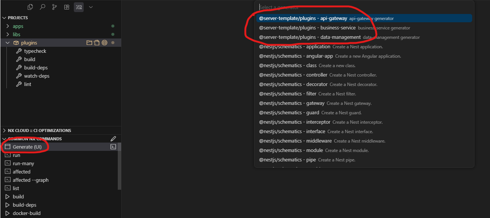
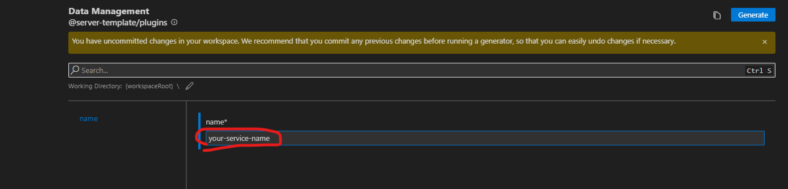

# ServerTemplate

## Introduction
<p>
The ServerTemplate is a microservice-based backend template designed to streamline the development process by establishing clear boundaries between different layers of the application. The template is organized into well-defined modules, allowing developers to work independently on specific areas, such as the API layer, business logic, and database management. This modularity makes the codebase more maintainable, scalable, and easier to extend.

This template is optimized for projects using NestJS for backend development and Prisma for database interactions. It provides a standardized architecture that reduces the time needed for setting up a new service and encourages best practices for separation of concerns.
</p>

## INIT

1. install modules

```shell=
npm ci
```

2. copy environment file

```shell=
npm run init
```

## [Nx CLI](./docs/nx-cli.md)

## Structure

### Layer

- API Router
    
    - The API Router layer acts as the entry point for all incoming requests to the microservice. It is responsible for handling HTTP requests, validating data, and routing these requests to the appropriate business services. In this layer, we define controllers that handle different routes and endpoints exposed by the service.
    - This layer is where the routing, authentication, and authorization logic resides. It ensures that only valid requests are passed on to the next layers of the application.

- Business Service

    - The Business Service layer encapsulates the core business logic of the microservice. It performs the necessary operations, such as processing data, implementing algorithms, and coordinating actions across different components of the application.
    - This layer contains services that communicate with the API Router to execute operations and return the required data or outcomes. It is decoupled from the API layer, making it easier to unit test and refactor business logic independently of the HTTP request-response cycle.

- Database Management

    - The Database Management layer is responsible for interacting with the database using an ORM like Prisma. This layer handles all database-related tasks, such as querying, inserting, updating, and deleting records, as well as managing schema migrations.
    - It also handles database connection pooling, indexing, and other database optimizations to ensure the performance and integrity of data. The Database Management layer is typically abstracted through services like `PrismaService` to keep database interactions separated from business logic.


## NX Operate

#### compiler install NX Console


---

### create plugin (plugins)

```shell=
npm i @nx/plugin
```

#### 1. init plugin framework


#### 2. create plugin generator


#### 3. edit plugins\generators.json factory and schema path dist to src

#### 4. paste the files you want to cover at files folder

#### 5. edit File extension to .template (ex: main.ts -> main.ts.template)

#### 6. edit file content you want to replace to <%= name %> 

#### 7. edit the {generator_name}.ts to edit the script

### create application (apps)

#### 1. choose @nx/nest application


#### 2. fill in application name 


#### 3. choose plugin to cover the structure witch layer the application is in


#### 4. fill the name witch step 2 fill



### create library (libs)


---
## Package.json Script

- clear nx cache

```shell=
npm run reset
```

